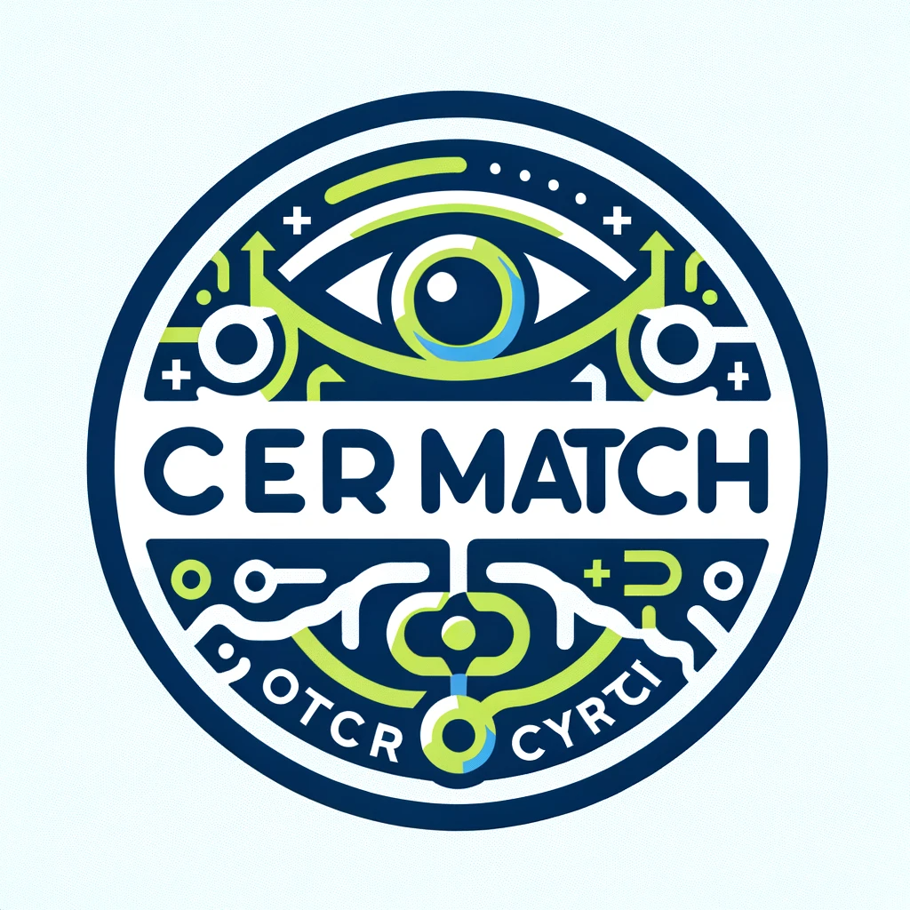

<p align="center">
  
</p>


# CERMatch

CERMatch is a novel Python library designed for evaluating Optical Character Recognition (OCR) systems using Character Error Rate (CER) based metrics. This library provides a unique method for matching ground truth text words with predicted words, offering a comprehensive analysis of OCR accuracy.


## Features

- **Calculate CER Match Score:** Compares predicted text against ground truth using CER.
- **Configurable Parameters:** Customize CER threshold, weights for match categories, and normalization settings.
- **Detailed Output:** Provides a composite score and ratios of matched, errored, invented, and missed words.
- **Flexibility:** Options for case sensitivity, special character inclusion, ASCII transliteration, and word list returns.


## How does it work?

CERMatch operates in several steps:

- **Normalization:** The input texts (both predicted and ground truth) are normalized by removing extra spaces, handling case sensitivity, special characters, and transliterating to ASCII as per configuration.

- **Word Comparison:** The normalized texts are split into words. Each word in the predicted text is then compared with the ground truth text.

- **CER Calculation:** For each predicted word, the Character Error Rate (CER) is calculated against each word in the ground truth. The CER threshold is used to determine if a word is considered a match, an error, or an invented word.

- **Scoring:** The algorithm calculates the percentages of matched, errored, invented, and missed words. These values are then used to compute a composite score based on provided weights, giving a holistic view of the OCR's accuracy.

- **Output:** CERMatch returns a dictionary with the composite score and ratios of each word category. Optionally, it can also return lists of words in each category for a more detailed analysis.


## Installation

Install CERMatch using pip:

```bash
pip install cermatch
```

## Usage

Here is a basic example of how to use CERMatch:

```python
from cermatch import calculateCERMatch

text_pred = "Hello, my namo is me Diego Bonilla"
text_gt = "Hello, my name is Diego Bonilla S."

result = calculateCERMatch(text_pred, text_gt)
print(result)

# Output: {'composite_score': 0.7642857142857142, 'ratio_matched': 0.7142857142857143, 'ratio_errors': 0.14285714285714285, 'ratio_invented': 0.14285714285714285, 'ratio_missed': 0.14285714285714285}
```

## LICENSE

CERMatch is licensed under the MIT License - see the LICENSE file for details.


